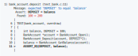
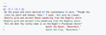
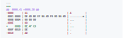

<picture>
  <source media="(prefers-color-scheme: dark)" srcset=".github/audition-dark.svg">
  <source media="(prefers-color-scheme: light)" srcset=".github/audition.svg">
  
</picture>

**Audition** is a modern testing framework for C11 and beyond.

[](https://RailgunLabs.com/audition)&nbsp;
[](https://github.com/RailgunLabs/audition-examples)&nbsp;
[](https://RailgunLabs.com/audition/manual)

Audition is closed-source.
This repository contains the public header file and license text for Audition, allowing you to transparently track changes over time.
To install Audition on your system, download the appropriate binary for your platform from the [releases page](https://github.com/RailgunLabs/audition/releases/).
For more detailed installation instructions, visit the [project's webpage](https://railgunlabs.com/audition/manual/#installing-audition).

## Features

* xUnit framework design (i.e. tests, suites, fixtures)
* Automatic test registration [\[1\]](#automatic-test-registration)
* Function mocking [\[2\]](#function-mocking)
* Type-generic assertion macros
* Parameterized test cases
* Detailed error reporting [\[3\]](#detailed-error-reporting)
* Sandbox isolation for catching crashes, timeouts, exit codes, and signals [\[4\]](#sandbox-isolation)
* Support for testing standard streams (`stdout`, `stderr`, and `stdin`)
* Test reporters for TAP, JUnit XML, and Subunit
* Available for Windows, Linux, and macOS

## Automatic Test Registration

Test cases are automatically registered, no boilerplate needed.
The following is a _complete_ program:

```c
#include <audition.h>

TEST(math, arithmetic) {
    ASSERT_EQ(add(1, 2), 3);
}

TEST(math, trigonometry) {
    ASSERT_EQ_APPROX(cos(0.0), 1.0, 0.001);
}
```

## Implicit Entry Point

The `main` function is provided by Audition unless you need to provide one for specialized behavior.

Audition's entry point accepts various program arguments, such as to filter which tests are executed.
The following example demonstrates using a **glob pattern** to run all test cases in the 'math' suite that begin with the name 'arith'.

```sh
$ your_test_runner.exe math.arith*
```

## Function Mocking

Mocks do **not** require access or modification to the original source code.
They do **not** depend upon linker flags, code generators, or compiler plugins.
They work like magic:

```c
TEST(network, empty_response) {
    STUB(recvfrom, 0);        // Mock recvfrom() to always return zero.
    read_network_response();  // The function that calls recvfrom();
}
```

## Type Generic Assertions

Assertion macros are _type generic_.
The following example demonstrates how integers, floats, and pointers can be asserted using the same type-generic macro.

```c
int   x = 1;
float y = 2.0f;
void *z = 0x0;

ASSERT_EQ(x, 1);
ASSERT_EQ(y, 2.0f);
ASSERT_EQ(z, NULL);
```

## Sandbox Isolation

Tests can be executed in a separate address space known as the _sandbox_ which prevents crashes and timeouts from taking down the test runner.
The sandbox is also used to test intentional termination and POSIX signals.

The following test case expects the program to terminate with status code 2.

```c
TEST(app, fatal_error, .exit_code=2) {
    abnormal_exit(); // The function that calls exit(2);
}
```

The following test case will be aborted if it runs longer than three seconds.

```c
TEST(app, possible_deadlock, .timeout=3000 /* milliseconds */) {
    code_that_might_hang();
}
```

## Detailed Error Reporting

Audition's default error reporter displays a C source code excerpt for failing assertions.
This provides immediate insight into the code that failed and where.

<picture>
  <source media="(prefers-color-scheme: dark)" srcset=".github/errors-dark.svg">
  <source media="(prefers-color-scheme: light)" srcset=".github/errors.svg">
  
</picture>

### String Diff

When comparing multi-line strings or binary blobs Audition prints a diff indicating where mismatches occurred.

<picture>
  <source media="(prefers-color-scheme: dark)" srcset=".github/strings-dark.svg">
  <source media="(prefers-color-scheme: light)" srcset=".github/strings.svg">
  
</picture>

### Binary Diff

<picture>
  <source media="(prefers-color-scheme: dark)" srcset=".github/binary-dark.svg">
  <source media="(prefers-color-scheme: light)" srcset=".github/binary.svg">
  
</picture>

## License

Audition is available under an End-User License Agreement (EULA) for personal and demo use.
For business use or other specific licensing needs, a separate licensing agreement must be obtained from Railgun Labs, LLC.
By using this library, you agree to comply with the terms and conditions of the license.
